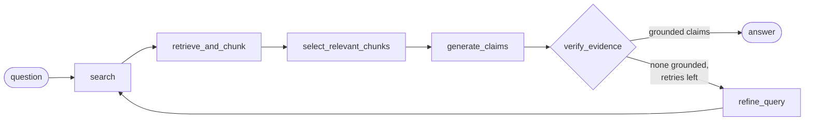

# Academic Search Agent

Ask a research question and get an answer where **every claim is tied to the exact passage it came from**.

A regular LLM chat can invent sources and facts. This project keeps retrieving evidence and writing the answer as two separate steps. First it searches the web and scrapes the full text of each source. Then Gemini writes the answer **only from those passages**, citing a passage ID for each claim. Before the answer reaches the user, any claim that can't be traced to a real passage is removed. In the UI, each citation shows the quoted text and links to its source.

## How it works

The research pipeline is a [LangGraph](https://langchain-ai.github.io/langgraph/) state machine ([`backend/app/agents/graph.py`](backend/app/agents/graph.py)):



| Step | What it does |
|---|---|
| **search** | Firecrawl web search for up to `MAX_SOURCES` (6) pages. |
| **retrieve_and_chunk** | Scrapes each page to Markdown, splits it into numbered lines, and groups the lines into paragraph chunks of at most 20 lines. Each chunk keeps its URL, title, and line range. A page that fails to scrape is skipped and the run continues. |
| **select_relevant_chunks** | Embeds the chunks with `gemini-embedding-2` into a temporary in-memory Chroma collection and keeps the `TOP_K_CHUNKS` (25) closest to the question. If embedding fails, it keeps the first 25 chunks instead. |
| **generate_claims** | `gemini-3.6-flash` returns structured output: a `summary`, a list of `claims` (each with `evidence_ids` and a `confidence`), and a `conclusion`. |
| **verify_evidence** | Removes evidence IDs that don't match a chunk that was actually selected, and drops any claim left with no valid evidence. |
| **refine_query** | Runs only if no claims survived verification: Gemini rewrites the search query and the loop runs again, up to `MAX_RETRIES` (2) times. |

You can tune the pipeline in [`backend/app/agents/constants.py`](backend/app/agents/constants.py).

## Tech stack

| Layer | Technology |
|---|---|
| Backend | Python 3.12, FastAPI, Pydantic, [uv](https://docs.astral.sh/uv/) |
| Agent orchestration | LangGraph, LangChain |
| Search & scraping | [Firecrawl](https://firecrawl.dev) |
| LLM & embeddings | Google Gemini (`gemini-3.6-flash`, `gemini-embedding-2`) |
| Vector search | Chroma (in-memory, per request) |
| Frontend | React 19, TypeScript, Vite 8 |
| Deployment | Docker Compose, nginx |
| CI | GitHub Actions (backend tests on every push and PR) |

## Quick start (Docker)

You need Docker, a [Firecrawl API key](https://firecrawl.dev), and a [Gemini API key](https://aistudio.google.com/apikey).

```bash
cp backend/.env.example backend/.env   # then fill in both keys
docker compose up --build
```

Open **http://localhost:3000**. nginx serves the UI and proxies `/api/` to the backend container. The backend is not exposed on the host.

## Local development

### Backend

```bash
cd backend
cp .env.example .env        # fill in FIRECRAWL_API_KEY and GEMINI_API_KEY
uv sync
uv run uvicorn app.main:app --reload
```

The API runs at `http://127.0.0.1:8000`, with interactive docs at `/docs`.

### Frontend

Requires Node **20.19+ or 22.12+** (Vite 8 won't start on Node 18).

```bash
cd frontend
npm install
npm run dev
```

The UI runs at `http://localhost:5173` and calls the backend at `http://127.0.0.1:8000/api/v1`. To use a different backend, set `VITE_API_BASE_URL`. The backend's CORS policy only allows `http://localhost:5173`.

### Tests

```bash
cd backend
uv run pytest
```

Firecrawl, Gemini, and the vector store are mocked in the tests, so the suite makes no real API calls.

## Configuration

| Variable | Where | Description |
|---|---|---|
| `FIRECRAWL_API_KEY` | `backend/.env` | Firecrawl search and scrape. **Required.** |
| `GEMINI_API_KEY` | `backend/.env` | Gemini generation and embeddings. **Required.** |
| `VITE_API_BASE_URL` | frontend build env | API base URL. Set to `/api/v1` in `.env.production` for the Docker/nginx setup. |

## API

All endpoints except `/health` are under `/api/v1`.

| Method | Path | Body | Returns |
|---|---|---|---|
| `GET` | `/health` | — | `{"status": "ok"}` |
| `POST` | `/api/v1/answer` | `{"question": str}` (3–500 chars) | Full research answer (see below) |
| `POST` | `/api/v1/search` | `{"query": str, "limit": 1–20}` | Search results only (title, URL, snippet) |
| `POST` | `/api/v1/documents` | `{"url": str}` | Scraped page split into numbered lines |

Example:

```bash
curl -X POST http://127.0.0.1:8000/api/v1/answer \
  -H "Content-Type: application/json" \
  -d '{"question": "What is the difference between Adam and AdamW?"}'
```

```jsonc
{
  "question": "What is the difference between Adam and AdamW?",
  "summary": "…",
  "claims": [
    { "text": "AdamW decouples weight decay from the gradient update.",
      "evidence_ids": ["3f2c…"], "confidence": "high" }
  ],
  "conclusion": "…",
  "evidence": {
    "3f2c…": {
      "chunk_id": "3f2c…", "document_id": "https://…", "text": "…",
      "source_url": "https://…", "title": "…", "start_line": 41, "end_line": 58
    }
  }
}
```

Every ID in a claim's `evidence_ids` has a matching entry in `evidence`, including the passage text and its line range in the source.

## Project structure

```
academic-search-agent/
├── backend/
│   ├── app/
│   │   ├── main.py            # FastAPI app, CORS, routers
│   │   ├── api/routes/        # /answer, /search, /documents
│   │   ├── agents/            # LangGraph graph, state, nodes, constants
│   │   ├── providers/         # Firecrawl, Gemini, embeddings, prompts
│   │   ├── retrieval/         # line splitter, chunker, vector store
│   │   ├── services/          # ResearchService and friends
│   │   ├── schemas/           # Pydantic request/response models
│   │   └── core/config.py     # settings from .env
│   ├── tests/
│   └── Dockerfile
├── frontend/
│   ├── src/                   # App, citation components, API client
│   ├── nginx.conf             # serves the SPA, proxies /api/ to backend
│   └── Dockerfile
├── docker-compose.yml
└── .github/workflows/ci.yml
```

## Limitations

- **`/answer` is synchronous and can be slow.** A full run (search, scrape, embed, generate, and possibly two refine loops) can take a minute or more. The nginx proxy timeout is 120 s.
- **Nothing is persisted.** Each request builds and discards its own vector collection; there is no caching between questions.
- **Gemini free-tier quotas are small.** Each answer makes several Gemini calls (embeddings, generation, and possibly refine calls), so you can hit a free-tier daily limit quickly. Rate-limit and 503 errors are retried with backoff.

## Contributing

- `main`: stable, released state only
- `develop`: integration branch
- `feat/<name>`: one feature per branch, merged via PR

CI runs `uv run pytest` on every push and pull request.
