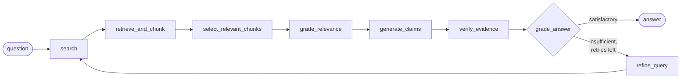

# Academic Search Agent

Ask a research question and get an answer where **every claim is tied to the exact passage it came from**.

A regular LLM chat can invent sources and facts. This project keeps retrieving evidence and writing the answer as two separate steps. First it searches the web and scrapes the full text of each source. Then the language model writes the answer **only from those passages**, citing a passage ID for each claim. Before the answer reaches the user, any claim that can't be traced to a real passage is removed. In the UI, each citation shows the quoted text and links to its source.

## How it works

The research pipeline is a [LangGraph](https://langchain-ai.github.io/langgraph/) state machine ([`backend/app/application/agents/graph.py`](backend/app/application/agents/graph.py)):



| Step | What it does |
|---|---|
| **search** | Firecrawl web search for up to `MAX_SOURCES` (6) pages. |
| **retrieve_and_chunk** | Scrapes each page to Markdown in parallel, splits it into numbered lines, and packs consecutive paragraphs into overlapping chunks of at most `CHUNK_CHAR_BUDGET` (1400) characters. A heading ships with the section it introduces, and a paragraph larger than the budget is split on word boundaries. Scraped pages are cached in-memory by URL for an hour. A page that fails to scrape is skipped and the run continues. |
| **select_relevant_chunks** | Embeds the chunks with `gemini-embedding-001` into a temporary in-memory Chroma collection and keeps the `TOP_K_CHUNKS` (25) closest to the question. If embedding fails, it keeps the first 25 chunks instead. |
| **grade_relevance** | The model judges which selected chunks are actually relevant to the question and drops the rest. If the judge rejects everything, no chunks survive and the run yields an empty answer rather than one built on irrelevant context. Chunks are kept only when the grading call itself fails. |
| **generate_claims** | The configured model returns structured output: a `summary`, a list of `claims` (each with `evidence_ids` and a `confidence`), and a `conclusion`. |
| **verify_evidence** | Removes evidence IDs that don't match a chunk that was actually selected, and drops any claim left with no valid evidence. |
| **grade_answer** | The model judges whether the generated answer is a satisfactory, on-topic response — can mark it insufficient even if the evidence was grounded. |
| **refine_query** | Runs only if the answer was judged insufficient: the model rewrites the search query and the loop runs again, up to `MAX_RETRIES` (1) time. |

You can tune the pipeline in [`backend/app/application/agents/constants.py`](backend/app/application/agents/constants.py) and the chunk sizes in [`backend/app/domain/text/chunker.py`](backend/app/domain/text/chunker.py).

## Tech stack

| Layer | Technology |
|---|---|
| Backend | Python 3.12, FastAPI, Pydantic, [uv](https://docs.astral.sh/uv/) |
| Agent orchestration | LangGraph, LangChain |
| Search & scraping | [Firecrawl](https://firecrawl.dev) |
| LLM | Gemini or OpenRouter, selected by `LLM_PROVIDER` |
| Embeddings | Google `gemini-embedding-001` |
| Vector search | Chroma (in-memory, per request) |
| Frontend | React 19, TypeScript, Vite 8 |
| Deployment | Docker Compose, nginx |
| CI | GitHub Actions (backend tests, frontend lint and build) |

## Quick start (Docker)

You need Docker, a [Firecrawl API key](https://firecrawl.dev), and a [Gemini API key](https://aistudio.google.com/apikey).

```bash
cp backend/.env.example backend/.env   # then fill in both keys
docker compose up --build
```

Open **http://localhost:3000**. nginx serves the UI and proxies `/api/` to the backend container. The backend is not exposed on the host.

## Local development

### Backend

```bash
cd backend
cp .env.example .env        # fill in FIRECRAWL_API_KEY and GEMINI_API_KEY
uv sync
uv run uvicorn app.main:app --reload
```

The API runs at `http://127.0.0.1:8000`, with interactive docs at `/docs`.

### Frontend

Requires Node **20.19+ or 22.12+** (Vite 8 won't start on Node 18).

```bash
cd frontend
npm install
npm run dev
```

The UI runs at `http://localhost:5173` and calls the backend at `http://127.0.0.1:8000/api/v1`. To use a different backend, set `VITE_API_BASE_URL`. The backend's CORS policy allows `http://localhost:5173` unless `CORS_ORIGINS` says otherwise.

### Tests

```bash
cd backend
uv run pytest
```

Firecrawl, the language models and the vector store are all mocked, so the suite makes no real API calls.

## Configuration

| Variable | Where | Description |
|---|---|---|
| `FIRECRAWL_API_KEY` | `backend/.env` | Firecrawl search and scrape. **Required.** |
| `GEMINI_API_KEY` | `backend/.env` | Embeddings always run on Gemini, so this is **required** whichever provider generates the answer. |
| `LLM_PROVIDER` | `backend/.env` | `gemini` (default) or `openrouter`. An unknown value is rejected at startup. |
| `OPENROUTER_API_KEY` | `backend/.env` | Required when `LLM_PROVIDER=openrouter`; startup fails without it. |
| `LLM_MODEL` | `backend/.env` | Overrides the provider's default model (`gemini-3.6-flash` / `openai/gpt-4o-mini`). |
| `EMBEDDING_MODEL` | `backend/.env` | Defaults to `models/gemini-embedding-001`. |
| `CORS_ORIGINS` | `backend/.env` | JSON list of allowed browser origins. Defaults to `["http://localhost:5173"]`. |
| `VITE_API_BASE_URL` | frontend build env | API base URL. Set to `/api/v1` in `.env.production` for the Docker/nginx setup. |

## API

All endpoints except `/health` are under `/api/v1`.

| Method | Path | Body | Returns |
|---|---|---|---|
| `GET` | `/health` | — | `{"status": "ok"}` |
| `POST` | `/api/v1/answer` | `{"question": str}` (3–500 chars) | Full research answer (see below) |
| `POST` | `/api/v1/answer/stream` | same as `/answer` | Server-sent events: a `progress` event per pipeline stage, then one `result` or `error`. This is what the UI uses. |
| `POST` | `/api/v1/search` | `{"query": str, "limit": 1–20}` | Search results only (title, URL, snippet) |
| `POST` | `/api/v1/documents` | `{"url": str}` | Scraped page split into numbered lines |

Example:

```bash
curl -X POST http://127.0.0.1:8000/api/v1/answer \
  -H "Content-Type: application/json" \
  -d '{"question": "What is the difference between Adam and AdamW?"}'
```

```jsonc
{
  "question": "What is the difference between Adam and AdamW?",
  "summary": "…",
  "claims": [
    { "text": "AdamW decouples weight decay from the gradient update.",
      "evidence_ids": ["3f2c…"], "confidence": "high" }
  ],
  "conclusion": "…",
  "evidence": {
    "3f2c…": {
      "chunk_id": "3f2c…", "document_id": "https://…", "text": "…",
      "source_url": "https://…", "title": "…", "start_line": 41, "end_line": 58
    }
  },
  "evidence_sufficient": true
}
```

Every ID in a claim's `evidence_ids` has a matching entry in `evidence`, including the passage text and its line range in the source.

## Project structure

```
academic-search-agent/
├── backend/
│   ├── app/
│   │   ├── main.py            # composition root: builds the layers, wires FastAPI
│   │   ├── domain/            # entities and pure algorithms — no I/O, no framework
│   │   │   └── text/          # latex, evidence-id cleanup, line splitter, chunker
│   │   ├── ports/             # the Protocols the pipeline depends on
│   │   ├── infrastructure/    # adapters: llm/, search/, embeddings/, vector_store/
│   │   ├── application/       # agents/ (LangGraph) and services/
│   │   ├── api/               # routes and request/response DTOs
│   │   └── core/              # settings, exceptions, logging
│   ├── tests/
│   └── Dockerfile
├── frontend/
│   ├── src/                   # App, citation components, API client
│   ├── nginx.conf             # serves the SPA, proxies /api/ to backend
│   └── Dockerfile
├── docker-compose.yml
├── CHANGELOG.md
└── .github/workflows/ci.yml
```

The backend is laid out in layers, and dependencies only ever point inward:

| Layer | May depend on | Holds |
|---|---|---|
| `domain` | nothing of ours | Chunks, claims, answers; LaTeX restoration, chunking |
| `ports` | `domain` | `LLMProvider`, `SearchProvider`, `EmbeddingsProvider`, `VectorStore` |
| `infrastructure` | `domain`, `ports`, `core` | Firecrawl, Chroma, Gemini embeddings, the LLM adapters |
| `application` | the above | the LangGraph pipeline and the services around it |
| `api` | the above | FastAPI routes and DTOs |

`tests/test_architecture.py` enforces this by reading each module's imports, so
a shortcut across layers fails CI rather than accumulating.

### Adding an LLM provider

Write an adapter in `app/infrastructure/llm/` deriving from
`LangChainLLMProvider` (it supplies a chat model and two names — prompts,
structured output and retries are inherited), add its name to `ProviderName` in
`app/core/config.py`, and add one entry to `REGISTRY` in
`app/infrastructure/llm/registry.py`. Nothing in the agent, the services or the
API changes: they all depend on the `LLMProvider` port.

## Limitations

- **`/answer` is synchronous and can be slow.** A full run (search, scrape, embed, generate, and possibly two refine loops) can take a minute or more. The nginx proxy timeout is 120 s.
- **Scraped pages are cached, nothing else is.** Each `/answer` request re-embeds
  its chunks and builds a fresh in-memory vector collection; only the raw
  scraped page content is cached (by URL, one hour TTL).
- **Gemini free-tier quotas are small.** Each answer makes several model calls (embeddings, generation, and possibly refine calls), so you can hit a free-tier daily limit quickly. Set `LLM_PROVIDER=openrouter` to move generation and grading off Gemini; embeddings stay on Gemini either way. Rate-limit and 503 errors are retried with backoff.

## Contributing

- `main`: stable, released state only
- `develop`: integration branch
- `feat/<name>`: one feature per branch, merged via PR

CI runs the backend test suite and the frontend lint and build on every push and pull request.
