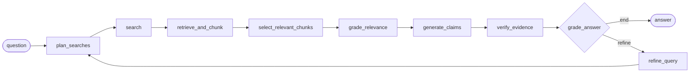

# Academic Search Agent

Ask a research question and get an answer where **every claim is tied to the exact passage it came from**.

A regular LLM chat can invent sources and facts. This project keeps retrieving evidence and writing the answer as two separate steps. First it searches the web and scrapes the full text of each source. Then the language model writes the answer **only from those passages**, citing a passage ID for each claim. Before the answer reaches the user, any claim that can't be traced to a real passage is removed. In the UI, each citation shows the quoted text and links to its source.

## How it works

The research pipeline is a [LangGraph](https://langchain-ai.github.io/langgraph/) state machine ([`backend/app/application/agents/graph.py`](backend/app/application/agents/graph.py)):


```mermaid
flowchart LR
    Q([question]) --> P[plan_searches]
    P --> S[search]
    S --> R[retrieve_and_chunk]
    R --> SEL[select_relevant_chunks]
    SEL --> GR[grade_relevance]
    GR --> G[generate_claims]
    G --> V[verify_evidence]
    V --> GA{grade_answer}
    GA -- end --> A([answer])
    GA -- refine --> RF[refine_query]
    RF --> P
```

After `grade_answer`, `should_refine` ends the run when the answer is sufficient, when `MAX_RETRIES` retries have been used, or when the grader judged it not a research question; otherwise it goes to `refine_query`, which leads back to planning rather than straight to search, so the rewritten query is spread over several searches too.

| Step | What it does |
|---|---|
| **plan_searches** | The model plans up to `MAX_QUERIES` (4) searches that approach the question from different directions. A planned query that keeps less than about half of the question's subject words has left the subject and is discarded; the question itself is always searched. A question asking for recent work ("latest", "recent", a recent year) limits the search to the last `RECENCY_WINDOW_YEARS` (3) years. On a retry it plans from the rewritten query. |
| **search** | Runs the planned queries on Firecrawl in parallel, `RESULTS_PER_QUERY` (10) results each, and chooses the `MAX_SOURCES` (12) candidates worth reading ([`backend/app/domain/sources.py`](backend/app/domain/sources.py)). Scholarly hosts (publishers, preprint servers, proceedings, `.edu`/`.ac.*`, lab research sites) lead, then encyclopedias, documentation and well-known blogs; Reddit, YouTube, Medium and the like are demoted but never excluded. Relevance to the question and the engine's own ranking count for more than the host does, so an on-topic tutorial beats a paper that only grazes the subject. Every query's best result gets a slot, each further page from one host costs it, and a page titled like one already chosen — the same paper on another site — waits behind every distinct page. |
| **retrieve_and_chunk** | Scrapes each page to Markdown in parallel, splits it into numbered lines, and packs consecutive paragraphs into overlapping chunks of at most `CHUNK_CHAR_BUDGET` (1400) characters. A heading ships with the section it introduces, and a paragraph larger than the budget is split on word boundaries. Scraped pages are cached in-memory by URL for an hour. A page that fails to scrape is skipped and the run continues. Pages that turn out to be the same document on different sites are dropped before anything is embedded, as are duplicate passages. |
| **select_relevant_chunks** | Embeds the chunks with `gemini-embedding-001` into a temporary in-memory Chroma collection and ranks every chunk by closeness to the question (by BM25 over the question's words if embedding fails). It then keeps `TOP_K_CHUNKS` (60), giving each source a turn before any page repeats, so one long page cannot take every slot. |
| **grade_relevance** | The model judges which selected chunks are actually relevant to the question and drops the rest, in parallel batches of `GRADE_BATCH_SIZE` (8). If the judge rejects everything, no chunks survive and the run yields an empty answer rather than one built on irrelevant context. A batch's chunks are kept only when the grading call for that batch itself fails. |
| **generate_claims** | The configured model returns structured output: first an `answer_shape` — `direct` for one core answer, written as prose, or `survey` for several aspects, written as claims grouped under numbered themes — then a `summary`, a list of `claims` (each with `evidence_ids`, a `confidence` and, for a survey, a `theme`), and a `conclusion`. Each passage is shown with its page's own authors and year when the page declares them in its citation tags, and an attribution's year is then set from that record: "Cheng et al. (2022)" becomes 2023 if the cited page says 2023. A source named only in a section heading is moved into the claim, so the claim is the one place its source is named. An answer that still shows an evidence ID, has a formula damaged beyond repair, leaves an equation as plain text, or drops every equation the passages state is generated once more and the less flawed of the two kept; one that still shows an evidence ID after that is not returned. |
| **verify_evidence** | Removes evidence IDs that don't match a chunk that was actually selected, and drops any claim left with no valid evidence. |
| **grade_answer** | The model judges whether the generated answer is a satisfactory, on-topic response — can mark it insufficient even if the evidence was grounded — and, if not, why: off topic, too thin, missing an aspect, built on non-substantive pages, or not a question a literature search can answer. When no claim survived verification the model is not asked; the answer is insufficient and no reason is recorded. |
| **refine_query** | Runs only if the answer was judged insufficient, and not when the grader judged it not a question a literature search can answer. That judgement needs a grounded answer to grade: when no claim survived verification the grader is not asked, and the retry runs. The model is given the searches already run and the grader's reason the answer fell short, writes a search aimed at that, and the loop runs again, up to `MAX_RETRIES` (1) time. The first answer is kept: if the retry finds nothing, or every search fails, the reader still gets it, marked as insufficient. |

You can tune the pipeline in [`backend/app/application/agents/constants.py`](backend/app/application/agents/constants.py) and the chunk sizes in [`backend/app/domain/text/chunker.py`](backend/app/domain/text/chunker.py).

## Tech stack

| Layer | Technology |
|---|---|
| Backend | Python 3.12, FastAPI, Pydantic, [uv](https://docs.astral.sh/uv/) |
| Agent orchestration | LangGraph, LangChain |
| Search & scraping | [Firecrawl](https://firecrawl.dev) |
| LLM | Gemini or OpenRouter, selected by `LLM_PROVIDER` |
| Embeddings | Google `gemini-embedding-001` |
| Vector search | Chroma (in-memory, per request) |
| Frontend | React 19, TypeScript, Vite 8 |
| Deployment | Docker Compose, nginx |
| CI | GitHub Actions (backend tests, frontend lint and build) |

## Quick start (Docker)

You need Docker, a [Firecrawl API key](https://firecrawl.dev), and a [Gemini API key](https://aistudio.google.com/apikey).

```bash
cp backend/.env.example backend/.env   # then fill in both keys
docker compose up --build
```

Open **http://localhost:3000**. nginx serves the UI and proxies `/api/` to the backend container. The backend is not exposed on the host.

## Local development

### Backend

```bash
cd backend
cp .env.example .env        # fill in FIRECRAWL_API_KEY and GEMINI_API_KEY
uv sync
uv run uvicorn app.main:app --reload
```

The API runs at `http://127.0.0.1:8000`, with interactive docs at `/docs`.

### Frontend

Requires Node **20.19+ or 22.12+** (Vite 8 won't start on Node 18).

```bash
cd frontend
npm install
npm run dev
```

The UI runs at `http://localhost:5173` and calls the backend at `http://127.0.0.1:8000/api/v1`. To use a different backend, set `VITE_API_BASE_URL`. The backend's CORS policy allows `http://localhost:5173` unless `CORS_ORIGINS` says otherwise.

### Tests

```bash
cd backend
uv run pytest
```

Firecrawl, the language models and the vector store are all mocked, so the suite makes no real API calls.

## Configuration

| Variable | Where | Description |
|---|---|---|
| `FIRECRAWL_API_KEY` | `backend/.env` | Firecrawl search and scrape. **Required.** |
| `GEMINI_API_KEY` | `backend/.env` | Embeddings always run on Gemini, so this is **required** whichever provider generates the answer. |
| `LLM_PROVIDER` | `backend/.env` | `gemini` (default) or `openrouter`. An unknown value is rejected at startup. |
| `OPENROUTER_API_KEY` | `backend/.env` | Required when `LLM_PROVIDER=openrouter`; startup fails without it. |
| `LLM_MODEL` | `backend/.env` | Overrides the provider's default model (`gemini-3.6-flash` / `openai/gpt-4o-mini`). |
| `EMBEDDING_MODEL` | `backend/.env` | Defaults to `models/gemini-embedding-001`. |
| `CORS_ORIGINS` | `backend/.env` | JSON list of allowed browser origins. Defaults to `["http://localhost:5173"]`. |
| `VITE_API_BASE_URL` | frontend build env | API base URL. Set to `/api/v1` in `.env.production` for the Docker/nginx setup. |

## API

All endpoints except `/health` are under `/api/v1`.

| Method | Path | Body | Returns |
|---|---|---|---|
| `GET` | `/health` | — | `{"status": "ok"}` |
| `POST` | `/api/v1/answer` | `{"question": str}` (3–500 chars) | Full research answer (see below) |
| `POST` | `/api/v1/answer/stream` | same as `/answer` | Server-sent events: a `progress` event per pipeline stage, then one `result` or `error`. This is what the UI uses. |
| `POST` | `/api/v1/search` | `{"query": str, "limit": 1–20}` | Search results only (title, URL, snippet) |
| `POST` | `/api/v1/documents` | `{"url": str}` | Scraped page split into numbered lines |

Example:

```bash
curl -X POST http://127.0.0.1:8000/api/v1/answer \
  -H "Content-Type: application/json" \
  -d '{"question": "What is the difference between Adam and AdamW?"}'
```

```jsonc
{
  "question": "What is the difference between Adam and AdamW?",
  "summary": "…",
  "claims": [
    { "text": "AdamW decouples weight decay from the gradient update.",
      "evidence_ids": ["3f2c…"], "confidence": "high" }
  ],
  "conclusion": "…",
  "evidence": {
    "3f2c…": {
      "chunk_id": "3f2c…", "document_id": "https://…", "text": "…",
      "source_url": "https://…", "title": "…", "start_line": 41, "end_line": 58
    }
  },
  "evidence_sufficient": true
}
```

Every ID in a claim's `evidence_ids` has a matching entry in `evidence`, including the passage text and its line range in the source.

## Project structure

```
academic-search-agent/
├── backend/
│   ├── app/
│   │   ├── main.py            # composition root: builds the layers, wires FastAPI
│   │   ├── domain/            # entities and pure algorithms — no I/O, no framework
│   │   │   └── text/          # latex, evidence-id cleanup, line splitter, chunker
│   │   ├── ports/             # the Protocols the pipeline depends on
│   │   ├── infrastructure/    # adapters: llm/, search/, embeddings/, vector_store/
│   │   ├── application/       # agents/ (LangGraph) and services/
│   │   ├── api/               # routes and request/response DTOs
│   │   └── core/              # settings, exceptions, logging
│   ├── tests/
│   └── Dockerfile
├── frontend/
│   ├── src/                   # App, citation components, API client
│   ├── nginx.conf             # serves the SPA, proxies /api/ to backend
│   └── Dockerfile
├── docker-compose.yml
├── CHANGELOG.md
└── .github/workflows/ci.yml
```

The backend is laid out in layers, and dependencies only ever point inward:

| Layer | May depend on | Holds |
|---|---|---|
| `domain` | nothing of ours | Chunks, claims, answers; LaTeX restoration, chunking |
| `ports` | `domain` | `LLMProvider`, `SearchProvider`, `EmbeddingsProvider`, `VectorStore` |
| `infrastructure` | `domain`, `ports`, `core` | Firecrawl, Chroma, Gemini embeddings, the LLM adapters |
| `application` | the above | the LangGraph pipeline and the services around it |
| `api` | the above | FastAPI routes and DTOs |

`tests/test_architecture.py` enforces this by reading each module's imports, so
a shortcut across layers fails CI rather than accumulating.

### Adding an LLM provider

Write an adapter in `app/infrastructure/llm/` deriving from
`LangChainLLMProvider` (it supplies a chat model and two names — prompts,
structured output and retries are inherited), add its name to `ProviderName` in
`app/core/config.py`, and add one entry to `REGISTRY` in
`app/infrastructure/llm/registry.py`. Nothing in the agent, the services or the
API changes: they all depend on the `LLMProvider` port.

## Limitations

- **`/answer` is synchronous and can be slow.** A full run (search, scrape, embed, generate, and possibly two refine loops) can take a minute or more. The nginx proxy timeout is 120 s.
- **Scraped pages are cached, nothing else is.** Each `/answer` request re-embeds
  its chunks and builds a fresh in-memory vector collection; only the raw
  scraped page content is cached (by URL, one hour TTL).
- **Gemini free-tier quotas are small.** Each answer makes several model calls (embeddings, generation, and possibly refine calls), so you can hit a free-tier daily limit quickly. Set `LLM_PROVIDER=openrouter` to move generation and grading off Gemini; embeddings stay on Gemini either way. Rate-limit and 503 errors are retried with backoff.
- **On the free embedding tier, semantic ranking works for about one question a day.** The quota is 1000 embedded texts per day and a question produces 600–900 passages. Once it is spent, passages are ranked by BM25 over the question's subject words instead. That keeps the selection about the question — the earlier fallback took the first passages of each page — but it matches words, not meaning, and answers are noticeably better with embeddings available. The backend log says which was used: `Embedding/vector search failed, ranking N chunks by the question's terms instead`.
- **Formulas can arrive damaged.** The model returns JSON, where a backslash starts an escape, so a LaTeX command written with one can be decoded into a control character. The pipeline asks for `@` in its place, repairs what is reversible, and regenerates an answer whose formula is not; if the retry is damaged too, the answer is returned and the activity trail notes that a formula may be missing a symbol. `uv run python -m app.scripts.eval_maths` measures this against the live model.

- **The search planner only knows the vocabulary its model was trained on.** Breadth comes from the planner writing several differently-aimed queries, and in a narrow, fast-moving field the right queries name methods that may postdate the model. Measured on "latest research on mechanistic interpretability of transformers 2025-2026": the search provider ranks `transformer-circuits.pub` first for `mechanistic interpretability transformers circuit tracing 2025` and for `attribution graphs cross-layer transcoder`, so the source is indexed and reachable — but the planner (gpt-4o-mini) writes queries such as `mechanistic interpretability attention heads visual analysis`, even with those terms given as an example in its prompt, and the only page returned from that site is its index. The queries now stay inside the subject; they do not yet name what the field currently calls its methods. The fix that would is a second planning round that reads the titles the first search returned and takes its terms from them; it is not built.

- **Which hosts count as scholarly is a hand-written list.** [`backend/app/domain/sources.py`](backend/app/domain/sources.py) names publishers, preprint servers and reference sites, and recognises `.edu`, `.ac.*` and `.gov` hosts by pattern; an unlisted host is neutral, lifted a little by a DOI, a PDF or a journal name in its result. Judging from the title and snippet alone also misses a page whose title is too terse to name the subject — Hugging Face's `LoRA (Low-Rank Adaptation)` course page for a question about fine-tuning language models — unless several of the planned queries found it. `uv run python -m app.scripts.eval_sources` captures searches and compares selections on them.

## Contributing

- `main`: stable, released state only
- `develop`: integration branch
- `feat/<name>`: one feature per branch, merged via PR

CI runs the backend test suite and the frontend lint and build on every push and pull request.
